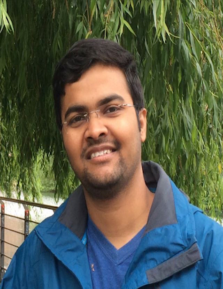

# About

The existing research in action recognition is mostly focused on high-quality videos where the action is distinctly visible. Therefore, the available action recognition models are not designed for low-resolution videos and their performance is still far from satisfactory when the action is not distinctly visible. In real-world surveillance environments, the actions in videos are captured at a wide range of resolutions. Most activities occur at a distance with a small resolution and recognizing such activities is a challenging problem.

The ActivityNet challenge has seen a wide range of tasks relevant to action recognition, ranging from temporal activity recognition to spatio-temporal action detection. However, in all the tasks we have seen so far, the focus has never been on low-resolution activities. In all the used datasets the videos are of high-resolution and the occurring activities cover most of the frame area.

In this challenge, the focus is on recognizing tiny actions in videos. The existing approaches addressing this issue perform their experiments on artificially created datasets where the high-resolution videos are down-scaled to a smaller resolution to create a low-resolution sample. However, re-scaling a high-resolution video to a lower- resolution does not reflect real world low-resolution video quality. Real world low-resolution videos suffer from grain, camera sensor noise, and other factors, which are not not present in the down-scaled videos. We will provide TinyVIRAT, a benchmark dataset for activity recognition which contains natural low-resolution activities.

# Dataset

We present a new benchmark dataset, TinyVIRAT, for low-resolution action recognition. The videos in TinyVIRAT are realistic and extracted from real-world surveillance videos. This is a multi-label dataset with multiple actions per video clip which makes it even more challenging. The dataset has around 13K video samples from 26 different actions and all the videos are captured at 30fps. There are a total of 26355 activity instances with 16950 training, 3308 validation and 6097 testing instances. The length of the activities vary from sample to sample with an average length of around 3 seconds. It contains arbitrary sized low-resolution videos which ranged from 10x10 pixels to 128x128 pixels with an average of 70x70 pixels. The videos in the proposed dataset are naturally low resolution and they reflect real-life challenges.

The dataset is available for download <a href="https://www.crcv.ucf.edu/tiny-actions-challenge-cvpr2021/data/TinyVIRAT-v2.zip"> here </a>. The baseline models are available on the <a href="https://github.com/aayushjr/tinyAction"> GitHub </a>. For more details refer to the <a href="https://arxiv.org/pdf/2107.11494.pdf"> paper </a>  
                                                                  

  
# Evaluation

TinyVIRAT has multiple labels in each sample and the submissions will be asked to predict multiple action classes for each sample. The performers can choose a prediction threshold of their choice and will be required to submit only the occurring activities for each sample. The submissions will be evaluated using precision, recall, and F1-score. The winners will be determined based on the F1-score averaged over each class.

We will provide an evaluation server where the performers can submit their results. A text file with multiple lines will be submitted by the performers for evaluation where each line will have predictions for a test sample. The performers will be required to submit a one-hot vector indicating which activities are present for each test sample. These one-hot vectors will be used to compute class-wise precision, recall, and F1-score. For action detection, the performers will submit a file with all the predictions which will include the class probablity and detected bounding boxes on each frame of a video. Sample submission file is available below.

   
Evaluation server: <a href="https://competitions.codalab.org/competitions/31843"> Link </a>

   
Sample submission: <a href="https://www.crcv.ucf.edu/tiny-actions-challenge-cvpr2021/data/submission_sample.zip"> Link </a>
  
  

# Important dates
- Workshop announcement: <strong>Jan 01, 2022</strong>
- Workshop paper submission deadline: <strong>March 15, 2022</strong>
- Notification to authors: <strong>April 01, 2022</strong>
- Camera ready deadline: <strong>April 08, 2022</strong>

# Organizers

  

     
    <a href="https://www.linkedin.com/in/praveen-tirupattur-2044ba51/">Praveen Tirupattur</a> 
    CRCV, University of Central Florida (UCF)
  

  
  

  

   
  

     
  <a href="https://www.crcv.ucf.edu/person/rawat/">Yogesh Rawat</a> 
    CRCV, University of Central Florida (UCF)
  

  
  

  

   
  

     
  <a href="">Tushar Sangam</a> 
    CRCV, University of Central Florida (UCF)
  

  
  

  

   
  

     
  <a href="https://www.crcv.ucf.edu/person/mubarak-shah">Mubarak Shah</a> 
    CRCV, University of Central Florida (UCF)
  

  

     
    <a href="">Aaysuh J Rana</a> 
    CRCV, University of Central Florida (UCF)
  

  
  

  
  

  

     
    <a href="">Shruthi</a> 
    CRCV, University of Central Florida (UCF)
  

  
  

  
  

# Contact

Feel free to contact us at yogesh@ucf.edu if you have any questions.
Join this mailing list for updates: https://groups.google.com/g/tinyactions
Thanks for being with us!

